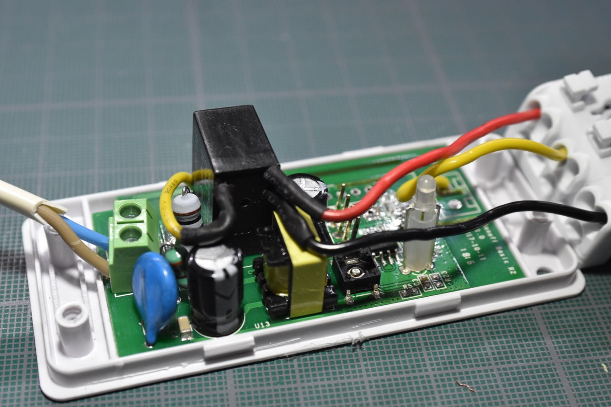
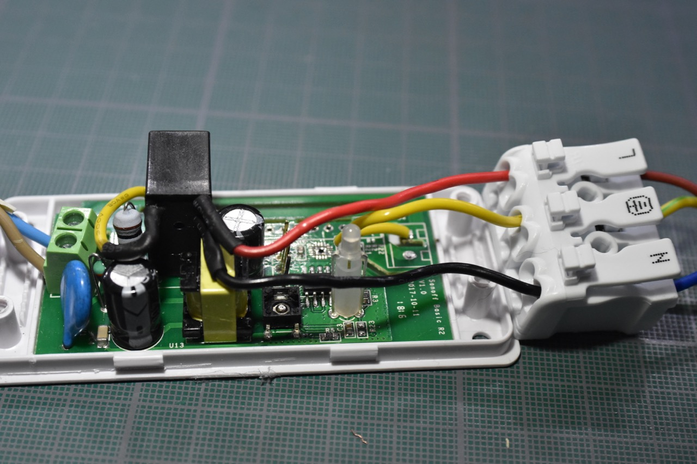

# Automatic water shut off valve using Home Assistant

Video demonstration:

[](http://www.youtube.com/watch?v=Bhpk5eZIy3k "Demonstration")

After having flooded my downstairs neighbours, I added some [Xiaomi Aquara Water sensor](https://www.gearbest.com/home-smart-improvements/pp_668897.html?wid=1527929) to get some early warning in case of leaks. They've already proven useful but an alarm cannot do anything to stop a leak in progress by itself.

So I put together simple to automaticaly shut the water off when a leak is detected.

**STATUS**: not installed yet or tested in real world conditions.

## Bill of materials

* [Motorized Ball valve](https://amzn.to/2CDWZPb) The model will depend on your tubing diameter.
* [Sonoff Basic](https://amzn.to/2S0Skka)
* [SPDT Relay](https://www.sparkfun.com/products/100)
* A [Home Assistant](https://github.com/home-assistant/home-assistant) installation with a MQTT server.
* Some water leak detector compatible with HA, I've used the previously mentionned Xiaomi sensors, but other will probably work just as well.

## Principle of Operation

The valve works in a simple manner: The yellow/green wire is tied to Neutral.
If the brown wire receive current, the valve will close.
If the blue wire receive current, the valve will open.

It has built-in endstops and will open/close all the way before stopping.

Sonoff basic are extremely simple wifi controlled relays but there is a major flaw for this application:

They use a SPST-NO relay, and we need a SPDT relay. Fortunately, the fix is simple, just remove the relay and replace it with the one indicated above.



I've chosen to tombstone the new relay. The coil pins are just bent and inserted in the previous holes.
The common pin is tied to the Line input.
The NO pin goes to the brown (close) wire of the valve.
The NC pin goes to the blue (open) wire of the valve.
The yellow/green wire of the valve is tied to neutral, using the hole of the output connector that I've removed.



## Software

[Tasmota](https://github.com/arendst/Sonoff-Tasmota) has been installed on the sonoff basic and is configured to connect to a MQTT server.

HA serves as a bridge between the water detector and the Sonoff, here is the configuration.

```yaml
switch:
  - platform: mqtt
    name: Main Water Valve
    state_topic: "stat/water_valve/POWER"
    command_topic: "cmnd/water_valve/POWER"
    availability_topic: "tele/water_valve/LWT"
    payload_available: "Online"
    payload_not_available: "Offline"
    qos: 1
    payload_on: "OFF"
    payload_off: "ON"
    retain: true

automation:
  - alias: Shut water valve in case of leaks
    trigger:
      - platform: state
        from: 'off'
        to: 'on'
        entity_id: binary_sensor.water_leak_sensor_158d0001bb8aaf
      - platform: state
        from: 'off'
        to: 'on'
        entity_id: binary_sensor.water_leak_sensor_158d0001bbea15
      - platform: state
        from: 'off'
        to: 'on'
        entity_id: binary_sensor.water_leak_sensor_158d0001c35979
    action:
      service: switch.turn_off
      entity_id: switch.main_water_valve

homeassistant:
  customize:
    switch.main_water_valve:
      icon: 'mdi:water-pump'
```

Do note that the on/off payload is inverted from the usual configuration as I want it to be "activated" only when a leak is detected.

## TODO

 - [ ] Installation
 - [ ] Design a 3d printed enclosure
